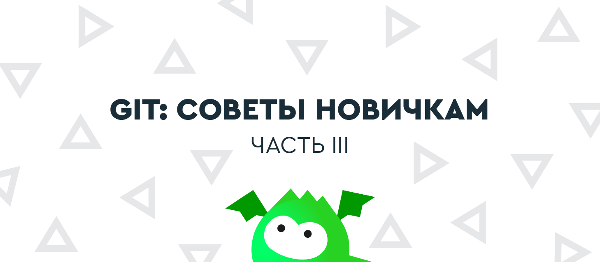
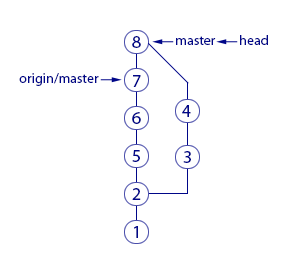
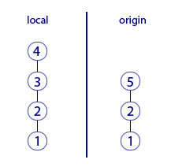
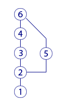

== Git: советы новичкам – часть 3

В финальной части нашей серии статей о работе с Git мы продолжим разговор о ветках, рассмотрим особенности работы с
командой push и расскажем, что такое rebase. Первую и вторую статьи серии вы можете прочитать по ссылкам.

=== Глава 16. Откуда взялась ветка?

Набираемся терпения и продолжаем рассматривать разные рабочие ситуации. Если мы сделаем несколько коммитов, а потом
выполним команду fetch (скачаем свежие коммиты, но пока не применим их в рабочий каталог), то увидим немного
сбивающую с толку картину:

image::img/pic2.png[This is alternative text]

Что это ещё за ветка получилась? Мы ведь не создавали никакой ветки. Может её создал кто-то из сотрудников?
Нет, никто её не создавал. Восстановим хронологию событий:

* Сначала мы скачали свежие коммиты. Тогда последним был коммит «2».
* Затем мы сделали коммиты «3» и «4» (но пока не пушили их).
* В это время другие сотрудники запушили в удалённый репозиторий коммиты «5», «6» и «7».
Тогда мы ничего не знали об этом.
* Наконец, мы сделали fetch и увидели то, что на картинке.

В Git каждый коммит хранит ссылку на предыдущий (это и позволяет нам соединять кружки на рисунках; каждый отрезок –
это ссылка на предыдущий коммит). Когда мы сделали коммит «3», для нас последним коммитом был «2» поэтому они соединены.
Но когда на origin кто-то запушил коммит «5», там последним был тоже коммит «2» –  ведь мы свои коммиты «3» и «4» ещё
не запушили, и на origin их не было. А раз так, то для коммита «5» предыдущим тоже выступает коммит «2»,
именно эту связь Git и запомнил.

Итого, разные люди независимо друг от друга поменяли результат коммита «2» – вот и возникла ветка. Кстати, эта ветка
сейчас есть только в нашем локальном репозитории. В origin её пока нет, поскольку коммиты «3» и «4» мы до сих пор
не запушили.

Что дальше? Поскольку мы сделали fetch, а не pull, то скачанные коммиты ещё не применились к нашему рабочему каталогу.
Давайте применим их – для этого выполним merge. Результат представлен на картинке:

Произошедшее уже знакомо нам. Образовался автоматический merge-commit «8» – master и head теперь указывают на него.
В рабочей копии появились изменения из коммитов «5», «6» и «7», которые объединились с нашими изменениями из коммитов
 «3» и «4». origin/master по-прежнему указывает на «7», поскольку последние наши операции проходили на
 локальном компьютере. А origin/master может сдвинуться только после общения нашего репозитория с origin.

 Наконец, делаем push, и вот теперь origin/master тоже указывает на «8», ведь:
 * Наш merge-commit «8» отправлен в origin.
 * Там он стал последним, а значит удалённый указатель master теперь показывает на него.
 * Нам скачалась информация об удалённом указателе master и мы её видим как origin/master.

 Вот он и показывает на «8». Логично.

 Не поддавайтесь малодушному желанию пропустить эти объяснения. В них нет ничего сложного, нужна лишь внимательность.
 Обязательно пройдитесь по шагам до тех пор, пока не поймете, почему все так работает.

 === Глава 17. Почему push выдаёт ошибку?

 Вы обязательно столкнетесь с тем, что Git выдаёт ошибку при команде push. В чём проблема? Почему он не принимает наши
  коммиты? Push успешно завершится, только если для каждого отправляемого в origin коммита Git сможет найти предшественника.
  Пример:

Здесь слева изображены коммиты в вашем локальном репозитории, а справа – коммиты в удалённом репозитории (origin).

Хронология этих коммитов следующая:

* Сначала в origin были коммиты «1» и «2».
* Мы сделали pull (в локальном репозитории тоже оказались лишь эти два коммита).
* Потом мы закоммитили «3» и «4» в локальный репозиторий (но не пушили).
* Кто-то запушил коммит «5» в origin.

И получилось то, что сейчас на картинке. Разобрались?

Теперь наша попытка запушить «3» и «4» в origin завершится ошибкой. Git откажется пристыковать наши коммиты к
последнему коммиту «5» в origin, поскольку в local предшественником для коммита «3» является коммит «2» – а вовсе
не «5», как в origin! Для Git важно, чтобы предшественник был тот же.

Проблема решается легко. Перед тем, как сделать push, мы сделаем pull (забираем коммит «5» себе). Тут вы можете
просить: «Секунду! А почему это забрать коммит «5» Git может, а послать коммиты «3» и «4» он не может? Вроде же
ситуация симметричная в обе стороны». Правильный вопрос! А ответ на него простой. Если бы Git позволил отправить
коммиты «3» и «4» в такой ситуации, то пришлось бы делать merge на стороне origin – а кто там будет разрешать
конфликты? Некому. Поэтому Git заставляет вас сначала забрать свежие коммиты себе, сделать merge на своем компьютере
(если будут конфликты, то разрешить их), а уже готовый результат он позволит вам отправить в origin командой push.
При этом, никаких конфликтов в origin уже быть не может.

Давайте посмотрим, как будет выглядеть локальная история, после того, как вы заберете коммит «5» командой pull.

Здесь у «3» и «5» предок «2», как и на предыдущей картинке. А новый коммит «6» – это уже давно
 известный нам merge-commit.

 В таком состоянии локальные коммиты уже можно запушить. Пусть тут и появилось разветвление истории, но обе ветки при
 мерже объединились. А значит голова у ветки снова одна. То есть, ничего не мешает сделать push. После этого в origin
 коммиты будут выглядеть такой же точно «петелькой».

 Теперь, когда push выдаст вам ошибку, вы уже знаете почему и что с этим делать.

 === Глава 18. Rebase

