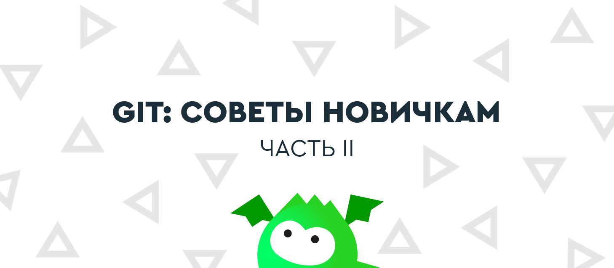

== Git: советы новичкам – часть 2
^Блог^ ^компании^ ^Playrix,^ ^Git^

Во второй части нашего пособия для новичков в Git мы рассказываем об управлении ветками, особенностях их слияния, а также о принципах работы указателей. Первую статью вы можете прочитать по https://habr.com/ru/company/playrix/blog/345732/[ссылке].

=== Глава 8. Ветки

Концепция веток не так проста. Представьте, что вам нужно внести множество изменений в файлы вашего рабочего каталога, но эта работа экспериментальная – не факт, что всё получится хорошо. Вы бы не хотели, чтобы ваши изменения увидели другие сотрудники до тех пор, пока работа не будет закончена. Может просто ничего не коммитить до тех пор? Это плохой вариант. Мы уже знаем, что частые коммиты и пуши – залог сохранности вашей работы, а также возможность посмотреть историю изменений. К счастью, в Git есть механизм веток, который позволит нам коммитить и пушить, но не мешать другим сотрудникам.

Перед началом экспериментальных изменений вы должны создать ветку. У ветки есть имя. Пусть она будет называться my test work. Теперь все ваши коммиты будут идти именно туда. До этого они шли в основную ветку разработки – будем называть её master. Другими словами, раньше вы были в ветке master (хоть и не знали этого), а сейчас переключились на ветку my test work. Это выглядит так:

image::img/git text 2.png[]

После коммита «3» создана ветка и ваши новые коммиты «4»и «5» пошли в неё. А ваши коллеги остались в ветке master, поэтому их новые коммиты «6», «7», «8» добавляются в ветку master. История перестала быть линейной.

На что это повлияло? Сотрудники теперь не видят изменений файлов, которые вы делаете. А вы не видите их изменений в своих рабочих файлах. Хотя историю изменений в ветке master вы все-таки посмотреть можете.

Итак, теперь вы сможете никому не мешая сделать свою экспериментальную работу. Если её результаты вас не устроит, вы просто переключитесь на ветку master (на её последний коммит – на рисунке это коммит «8»). В момент переключения файлы в вашей рабочей папке станут такими же, как у ваших коллег, а ваши изменения исчезнут. Теперь ваша рабочая копия стала слепком из коммита «8». По картинке видно, что в нём нет ваших изменений, сделанных в ветке my test work.

=== Глава 9. Слияние веток

Теперь мы знаем, что каждый может создать ветки и работать независимо. Можно по очереди работать то в одной ветке, то в другой – переключаясь между ними. Ветки переключает команда checkout.

Ветки используются не только для временной независимой работы. Часто мы одновременную готовим несколько версий игры. Например, одна версия уже почти готова к публикации и программисты вносят в неё последние исправления. В то же время гейм-дизайнеры уже занимаются следующим обновлением. Им нельзя работать в предыдущей версии потому, что:

* Их изменения не должны появиться в текущей версии;
* Любые изменения могут что-то сломать, поэтому перед публикацией версии нужно вносить в неё как можно меньше изменений.

Словом, от веток много пользы. Но вернёмся к примеру с вашей экспериментальной работой. В предыдущей главе мы решили, что она не удалась. Вы вернулись в ветку master и потеряли изменения, сделанные в ветке my test work. А если все получилось? Вы хотите перенести свои изменения в ветку master, чтобы их увидели сотрудники, которые с ней работают. Git может помочь – выполним команду merge ветки my test work в ветку master:

image::img/git text 3.png[]

Здесь коммит «8» – это специальный коммит, который называется merge-commit. Когда мы выполняем команду merge, система сама создает этот коммит. В нём объединены изменения ваших коллег из коммитов «5», «6», «7», а также ваша работа из коммитов «3», «4».

Изменения из коммитов «1» и «2» объединять не нужно, ведь они были сделаны до создания ветки. А значит изначально были и в ветке master, и в ветке my test work.

Команда merge ничего не посылает в origin. Единственный ее результат – это merge-commit (на рисунке кружок с номером 8), который появится у вас на компьютере. Его нужно запушить, как и ваши обычные коммиты. Только после этого merge-commit отправится на origin – тогда коллеги увидят результат вашей работы, сделав pull.

=== Глава 10. Несколько мержей из ветки А в ветку В

В предыдущей главе мы узнали, как сделать новую ветку, поработать в ней и залить изменения в главную ветку. На картинке после объединения ветки слились вместе. Означает ли это, что в ветке my test work теперь работать нельзя – она ведь уже объединилась с master? Нет, вы можете продолжать коммитить в ветку my test work и периодически мержить в главную ветку. Как это выглядит:

image::img/git text 4.png[]

Обратите внимание, что отрезки соединяющие ветки не горизонтальные – так показано, из какой ветки в какую был мерж. В этой ситуации было два мержа и оба из правой ветки в левую. Результатом первого объединения стал merge-commit «7», а второго – merge-commit «10». Поскольку мерж происходит из правой ветки в левую, то, например, в слепке «8» есть изменения, которые были сделаны в коммите «3». А вот в слепке «11» нет изменений, которые были сделаны в коммите «5». Убедитесь, что вы понимаете причину этого. Если нет, перечитайте главы о ветках ещё раз.

=== Глава 11. Мерж между ветками в обе стороны

В предыдущем примере мы всё время мержили из ветки my test work в ветку master. Можно ли мержить в обратную сторону и есть ли в этом смысл? Можно. Есть.

Если вы долго работаете в своей ветке, рекомендуется периодически делать мерж в неё из главной ветки. Это необходимо, чтобы вы работали с актуальными версиями файлов, которые меняют другие люди. Как это выглядит:

image::img/git text 5.png[]

Здесь два мержа из ветки my test work в ветку master и один мерж в обратную сторону. Результатом обратного объединения стал merge-commit «8». Благодаря ему, например, слепок коммита «11» содержит изменения из коммита «7». А вот изменений из коммита «9» в слепке «11» уже нет, ведь этот коммит был сделан после мержа.

=== Глава 12. Коммиты и их хеши

Как Git различает коммиты? На картинках мы для простоты помечали их порядковыми номерами. На самом деле каждый коммит в Git обозначается вот такой строкой:

e09844739f6f355e169f701a5b7ae02c214d5fb0

Это «названия» коммитов, которые Git автоматически даёт им при создании. Вообще, такие строки принято называть «хеш». У каждого коммита хеш разный. Если вы хотите кому-то сообщить об определённом коммите, можно отправить человеку хеш этого коммита. Зная хеш, он сможет найти этот коммит (если это ваш коммит, то, конечно, его надо сначала запушить).

=== Глава 13. Ветки и указатели

Сейчас мы немного углубимся в то, как Git хранит информацию о ветках. Вроде бы внутреннее устройство Git нас не должно волновать, но это позволит намного лучше понимать, что происходит при выполнении операций в Git. А вы, в свою очередь, сможете избежать ряда ошибок.

Познакомимся с концепцией «указателя». В упрощённом виде указатель состоит из своего названия и хеша. Вот пример указателя:

master – e09844739f6f355e169f701a5b7ae02c214d5fb0

Тут вы скажете: «master – знакомое имя! У нас так называлась главная рабочая ветка». И это совпадение не случайно. Git использует указатели для обозначения веток. Идея простая: если нужна новая ветка, Git создаёт новый указатель, даёт ему имя ветки и записывает в него хеш последнего (самого свежего) коммита ветки. Ветка создана!
Благодаря хешу в указателе можно сказать, что указатель ссылается или «указывает» на последний коммит ветки. Этого достаточно Git’у, чтобы выполнять все операции над ветками. То есть, никакой другой информации о том, какие коммиты принадлежат какой ветке Git не хранит. Вот так всё минималистично.

На каждую ветку есть свой указатель. Когда в ветку добавляется очередной коммит, хеш в указателе меняется, чтобы снова «указывать» на последний коммит. Это можно представить, как сдвигание указателя ветки на последний коммит с предпоследнего.

Если вы просите Git переключиться на другую ветку (команда checkout), ему достаточно найти указатель с именем этой ветки и взять из него хеш последнего коммита. Теперь Git знает, как должны выглядеть файлы вашего рабочего каталога (как слепок этого коммита). Git приводит файлы к такому виду – и переключение на ветку произошло.

Если вы не совсем поняли идею указателей и то, как они связаны с ветками, перечитайте главу ещё раз. В Git многое завязано на указатели, поэтому важно чётко понимать механику их работы. К счастью, она совсем не сложная, просто немного необычная. Нужно лишь привыкнуть.

=== Глава 14. Указатель head

Итак, мы знаем, что указатели – это такие штуки, у которых есть имя, и они ссылаются на определенный коммит (хранят его хеш). Мы знаем, что при необходимости новой ветки, Git создаёт указатель на ее последний коммит и двигает его вперед при каждом новом коммите.

Указатели используются не только для веток. Есть особый указатель head. Он указывает на коммит, который выступает состоянием вашего рабочего каталога. Поняли идею? Вот пример:

image::img/git text 6.png[]

Здесь мы видим две ветки, которые представлены двумя указателями: master и test. Мы находимся в ветке master и файлы нашего рабочего каталога соответствуют слепку коммита «4». Откуда мы это знаем? Из того, что указатель head указывает на коммит «4». Точнее, он указывает на указатель master, который указывает на коммит «4». Почему бы не указывать напрямую на коммит «4»? Зачем такой финт с указанием на указатель? Так Git обозначает, что сейчас мы находимся в ветке master.

Мы можем поставить указатель head на любой коммит – для этого есть команда checkout. Вспомним, что на какой коммит показывает head, в таком состоянии и будут файлы в рабочем каталоге (это свойство указателя head). Поэтому переставляя указатель head на другой коммит, мы тем самым заставим Git поменять файлы нашего рабочего каталога. Это может потребоваться, например, чтобы откатиться на старую версию рабочих  файлов и посмотреть, как там всё было. А потом можно вернуться назад к последнему коммиту ветки master (checkout master). Если же сделаем checkout test (см. картинку), то head будет указывать на указатель test, который указывает на последний коммит ветки test. Файлы в рабочем каталоге поменяются на слепок «6». Так мы переключились на ветку test.

Подытожим. Перестановка особого указателя head приводит к тому, что файлы рабочего каталога меняются на слепок этого коммита. Но только тогда, когда head указывает на указатель какой-то ветки, Git считает, что мы находимся в этой ветке.

А что происходит, если head указывает на какой-то коммит напрямую (хранит его хеш)?  Это состояние называется detached head. В него можно переключиться на время, чтобы посмотреть, как выглядели файлы рабочего каталога на одном из коммитов в прошлом.

Переключение (как между ветками, так и между обычными коммитами) выполняется командой checkout.

=== Глава 15. Указатель origin/master

Раз удалённый репозиторий (origin) такой же, как наш, значит там тоже есть свои указатели веток? Верно. Например, есть свой указатель master, который ссылается на самый свежий коммит в этой ветке.

Интересно, что когда мы забираем свежие коммиты из origin командой pull, то вместе с коммитами скачиваются и копии указателей оттуда. Чтобы не путать наш указатель master и тот, который скачался с origin, второй из них отображается у нас, как origin/master. Нужно понимать, что origin/master не показывает текущее состояние указателя master в удаленном репозитории, это лишь его копия на момент выполнения команд fetch или pull.

master и origin/master могут указывать на разные коммиты. Станет понятнее, если посмотреть на картинку:

image::img/git text 7.png[]

Здесь показана ситуация, когда мы забрали свежие коммиты (командой pull), сделали два новых коммита, но ещё не сделали push. В итоге наш локальный master показывает на последний  коммит. А origin/master – это последнее известное нам состояние указателя из удалённого репозитория. Поэтому он и «отстал».

После команды push два верхних коммита уйдут в origin и логично, что origin/master подвинется вверх и тоже будет указывать на наш последний коммит, как и master.

А может ли быть так, что origin/master будет наоборот выше, а master ниже? Может. Вот как это получается. Команда pull забирает свежие коммиты и сразу же помещает их в рабочий каталог. Сразу после команды pull оба указателя origin/master и master будут указывать на один и тот же последний коммит. Но есть ещё команда fetch. Она, как и pull, скачивает последние коммиты из origin, но не торопится обновлять рабочий каталог. Графически это выглядит так (если у вас нет незапушенных коммитов):

image::img/git text 8.png[]

До команды fetch указатель master показывал на коммит «3» и это был последний коммит в нашем репозитории. После fetch скачались два новых коммита «4» и «5». В удалённом репозитории указатель master, очевидно, указывал на коммит «5». Этот указатель скачался нам вместе с коммитами и теперь мы его видим как origin/master, указывающий на «5». Всё логично.

Зачем может потребоваться fetch? Например, вы не готовы менять состояние рабочего каталога, а просто хотите поглядеть, чего там накоммитили ваши коллеги? Вы делаете fetch и изучаете их коммиты. Когда будете готовы, делаете команду merge. Она применит скачанные ранее коммиты к вашему рабочему каталогу.

Поскольку в этом простом примере у вас не было незапушенных коммитов, то команде merge объединять ничего не придётся. Она просто подвинет указатели master и head – теперь они будут показывать на коммит «5». Как и origin/master.

Вы можете заметить, что ничего по-настоящему сложного в описанных механиках нет. Есть лишь множество деталей, в которых приходится кропотливо разбираться. Но Git – он такой.

В финальной части статьи мы расскажем о том, откуда взялась ветка, почему push выдаёт ошибку и что такое rebase. И, конечно, подведем итоги.

https://habr.com/ru/company/playrix/blog/345732/[→ Git: советы новичкам — часть 1] +
*→ Git: советы новичкам — часть 2* +
https://habr.com/ru/company/playrix/blog/350492/[→ Git: советы новичкам — часть 3]

~*Теги:*~ https://habr.com/ru/search/?q=%5BGit%5D&target_type=posts[~Git,~] https://habr.com/ru/search/?q=%5B%D1%81%D0%BE%D0%B2%D0%B5%D1%82%D1%8B%5D&target_type=posts[~советы~] +
~*Хабы:*~ https://habr.com/ru/company/playrix/[~Блог~ ~компании~ ~Playrix,~] https://habr.com/ru/hub/git/[~Git~]