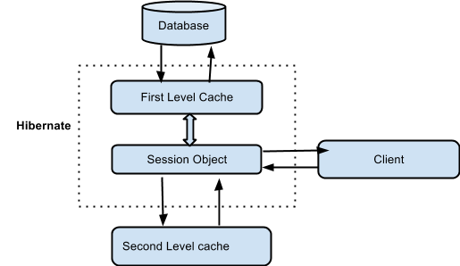

= Руководство по Hibernate. Кеширование.

Кеширование является одним из способов оптимизации работы приложения, ключевой задачей которого является уменьшить коли-
чество прямых обращений к базе данных (далее – БД).
Если речь идёт о *Hibernate*, то схематически кэширование можно представить в виде следующего рисунка:

*Кэш первого уровня (First Level Cache)*
Кэш первого уровня – это кэш *Сессии (Session)*, который является обязательным. Через него проходят все запросы.
Перед тем, как отправить объект в БД, сессия хранит объект за счёт своих ресурсов.

В том случае, если мы выполняем несколько обновлений объекта, *Hibernate* старается отсрочить (насколько это возможно)
обновление для того, чтобы сократить количество выполненных запросов. Если мы закроем сессию, то все объекты, находящие-
ся в кэше теряются, а далее – либо сохраняются, либо обновляются.

== Кэш второго уровня (Second level Cache)

Кэш второго уровня является необязательным (опциональным) и изначально *Hibernate* будет искать необходимый объект в кэше
первого уровня. В основном, кэширование второго уровня отвечает за кэширование объектов
*Кэш запросов (Query Cache)*
В *Hibernate* предусмотрен кэш для запросов и он интегрирован с кэшем второго уровня. Это требует двух дополнительных
физических мест для хранения кэшированных запросов и временных меток для обновления таблицы БД. Этот вид кэширования
эффективен только для часто используемых запросов с одинаковыми параметрами.
Рассмотрим, как это выглядит на практике.

.Developer.hbm.xml
[source,xml]
--
<?xml version="1.0" encoding="utf-8"?>
<!DOCTYPE hibernate-mapping PUBLIC
        "-//Hibernate/Hibernate Mapping DTD//EN"
        "http://www.hibernate.org/dtd/hibernate-mapping-3.0.dtd">

<hibernate-mapping>
    <class name="net.proselyte.hibernate.nativesql.Developer" table="HIBERNATE_DEVELOPERS">
        <meta attribute="class-description">
            This class contains developer details.
        </meta>
        <id name="id" type="int" column="id">
            <generator class="native"/>
        </id>
        <property name="firstName" column="FIRST_NAME" type="string"/>
        <property name="lastName" column="LAST_NAME" type="string"/>
        <property name="specialty" column="SPECIALTY" type="string"/>
        <property name="experience" column="EXPERIENCE" type="int"/>
        <property name="salary" column="SALARY" type="int"/>
    </class>

</hibernate-mapping>
--

.hibenrate.cfg.xml
[source,xml]
----
<?xml version="1.0" encoding="utf-8"?>
<!DOCTYPE hibernate-configuration SYSTEM
"http://www.hibernate.org/dtd/hibernate-configuration-3.0.dtd">

<hibernate-configuration>
<session-factory>
<property name="hibernate.dialect">
org.hibernate.dialect.MySQLDialect
</property>
<property name="hibernate.connection.driver_class">
com.mysql.jdbc.Driver
</property>

        <!-- Assume PROSELYTE_TUTORIAL is the database name -->
        <property name="hibernate.connection.url">
            jdbc:mysql://localhost/ИМЯ_ВАШЕЙ_БАЗЫ_ДАННЫХ
        </property>
        <property name="hibernate.connection.username">
            ВАШЕ_ИМЯ_ПОЛЬЗОВАТЕЛЯ
        </property>
        <property name="hibernate.connection.password">
            ВАШ_ПАРОЛЬ
        </property>

        <!-- List of XML mapping files -->
        <mapping resource="Developer.hbm.xml"/>

    </session-factory>
</hibernate-configuration>
----
Два предыдущих фала нам уже знакомы, а теперь нам необходимо создать файл `ehcache.xml`

.ehcache.xml
[source,xml]
----
<diskStore path="java.io.tmpdir"/>
<defaultCache
maxElementsInMemory="500"
eternal="false"
timeToIdleSeconds="60"
timeToLiveSeconds="60"
overflowToDisk="true"
/>

<cache name="Developer"
maxElementsInMemory="200"
eternal="true"
timeToIdleSeconds="0"
timeToLiveSeconds="0"
overflowToDisk="false"
/>
----
Для того, что кэширование стало доступным для нашего приложения мы должны активировать его следующим образом:
[source,html]
----
Session session = sessionFactory.openSession();
Query query = session.createQuery("FROM HIBERNATE_DEVELOPERS");
<strong>query.setCacheable(true);</strong>
<strong>query.setCacheRegion("developer");</strong>
List developers = query.list();
sessionFactory.close();
----
В этой статье мы рассмотрели основы кэширования в *Hibernate*.